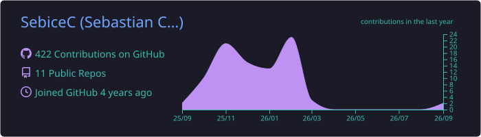
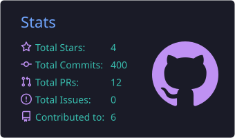
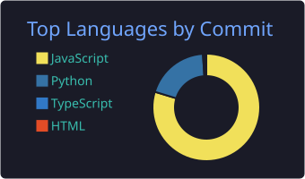

<!-- Banner -->

  

  

  
  

  <a href="#-english">🇺🇸 English</a> &nbsp;•&nbsp; <a href="#-español">🇨🇴 Español</a>

---

## 🇺🇸 English

### 👨‍💻 About me

I'm a **Software Engineer specialized in Data Security & Privacy**, focused on protecting the integrity of corporate information and leading cloud regulatory-compliance strategies.

- 🔐 **Data Security & Privacy Engineer** at **IndiGO Tech**
- 🛡️ Proposed, budgeted and led the implementation of **Microsoft Purview**
- 📋 Hands-on experience in audit & certification processes: **ISO 27001**, **ISO 27701** and **FDA** standards
- 🤖 Currently driving a **hub of AI-powered security agents**
- 🌎 Fluent in technical and business English with international B2B clients
- ✨ Passionate about the intersection of **cybersecurity and innovation**

### 🎯 Focus areas

| Area | What I do |
|---|---|
| 🗂️ **Data governance** | Classification, sensitivity labels, DLP and data lifecycle |
| ☁️ **Cloud security architecture** | Secure design on Azure and AWS |
| 📜 **Regulatory compliance** | ISO 27001 / 27701, FDA, audit readiness |
| 🧠 **AI for cybersecurity** | Security agents and automation powered by AI |

---

## 🇨🇴 Español

### 👨‍💻 Sobre mí

Soy **Ingeniero de Software especializado en Seguridad y Privacidad de Datos**, enfocado en proteger la integridad de la información corporativa y liderar estrategias de cumplimiento normativo en la nube.

- 🔐 **Ingeniero de Seguridad y Privacidad de Datos** en **IndiGO Tech**
- 🛡️ Propuse, presupuesté y dirigí la implementación de **Microsoft Purview**
- 📋 Experiencia práctica en auditorías y certificaciones: **ISO 27001**, **ISO 27701** y estándares **FDA**
- 🤖 Actualmente impulsando un **hub de agentes de seguridad con IA**
- 🌎 Inglés fluido, técnico y conversacional, en entornos B2B corporativos
- ✨ Me apasiona la intersección entre **ciberseguridad e innovación**

### 🎯 Áreas de enfoque

| Área | Qué hago |
|---|---|
| 🗂️ **Gobierno de datos** | Clasificación, etiquetas de sensibilidad, DLP y ciclo de vida del dato |
| ☁️ **Arquitectura de seguridad en la nube** | Diseño seguro en Azure y AWS |
| 📜 **Cumplimiento normativo** | ISO 27001 / 27701, FDA, preparación para auditorías |
| 🧠 **IA aplicada a ciberseguridad** | Agentes de seguridad y automatización con IA |

---

## 🏅 Certifications · Certificaciones

  
  
   
  
  

## 🧰 Tech stack · Tecnologías

**Security & Compliance**

  
  
  

**Cloud**

  
  
  

**Development**

  

## 🚀 Projects · Proyectos

| Project | Description | Stack |
|---|---|---|
| 🌱 [**ProyectoAgricola**](https://github.com/SebiceC/ProyectoAgricola) | Crop-water management software inspired by FAO's CROPWAT, with NASA weather API data · *Software de gestión hídrica de cultivos inspirado en CROPWAT, con datos de la API de la NASA* | Python · React · Docker |
| 🤖 **AI Security Agents Hub** *(in progress)* | AI-powered security agents for compliance automation · *Agentes de seguridad con IA para automatizar cumplimiento* | AI · Cloud |
| 📜 **Compliance projects** *(coming soon · próximamente)* | Regulatory compliance tooling and templates · *Herramientas y plantillas de cumplimiento normativo* | — |

## 📊 GitHub stats

<!-- Cards generated daily by .github/workflows/profile-cards.yml -->

  

  
  

  

## 🌐 Languages · Idiomas

🇨🇴 **Español** — Native · Nativo &nbsp;&nbsp;|&nbsp;&nbsp; 🇺🇸 **English** — Fluent, technical & B2B · Fluido, técnico y B2B

---

  <i>"Security is not a product, it's a process."</i> — Bruce Schneier

  

